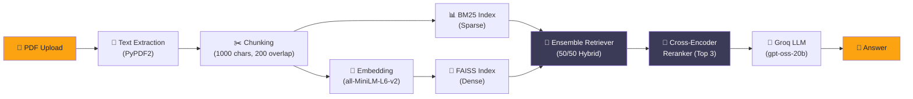

<div align="center">

# 📚 Agentic PDF Explorer

### Chat with your PDFs using Hybrid Search, Cross-Encoder Reranking & Agentic Memory

[](https://pdfchatwithai.streamlit.app/)


---

**Upload any PDF → Ask questions in natural language → Get accurate, context-aware answers powered by Groq's ultra-fast LPU inference.**

[Live Demo](https://pdfchatwithai.streamlit.app/) · [Report Bug](https://github.com/MonidipDas/PDFChatWithAI/issues) · [Request Feature](https://github.com/MonidipDas/PDFChatWithAI/issues)

</div>

---

## ✨ Features

| Feature | Description |
|---|---|
| 📄 **PDF Upload & Parsing** | Extract text from any PDF using PyPDF2 |
| 🔍 **Hybrid Search** | Combines dense (FAISS) and sparse (BM25) retrieval for comprehensive document search |
| 🎯 **Cross-Encoder Reranking** | Reranks retrieved results using `ms-marco-MiniLM-L-6-v2` for maximum relevance |
| 🧠 **Agentic Memory** | Persists conversation history so the AI retains context across questions |
| ⚡ **Groq LPU Inference** | Ultra-low latency answers via Groq's hardware-accelerated API |
| 📊 **Accuracy Dashboard** | Visual comparison of retrieval strategies (Dense vs Sparse vs Hybrid vs Reranked) |
| 🛡️ **Model Fallback** | Automatic failover across multiple Groq-hosted models |
| 🔄 **Rate Limiting & Retries** | Built-in rate limiter with exponential backoff for production reliability |

---

## 🏗️ Architecture



### Retrieval Pipeline

1. **Text Extraction** — PDF pages are parsed and concatenated into raw text
2. **Chunking** — Text is split into 1000-character chunks with 200-character overlap to preserve cross-boundary context
3. **Dual Indexing** — Chunks are indexed in both:
   - **FAISS** (dense vectors via `sentence-transformers/all-MiniLM-L6-v2`)
   - **BM25** (sparse keyword-based index via `rank_bm25`)
4. **Ensemble Retrieval** — Both retrievers are queried and results are fused using Reciprocal Rank Fusion (50/50 weighting)
5. **Cross-Encoder Reranking** — The fused results are rescored by `cross-encoder/ms-marco-MiniLM-L-6-v2` and the top 3 are kept
6. **LLM Generation** — The reranked context + conversation memory are passed to Groq for answer generation

---

## 🛠️ Tech Stack

| Layer | Technology | Purpose |
|---|---|---|
| **Frontend** | Streamlit | Interactive web UI with tabs, sidebar, and chat interface |
| **PDF Parsing** | PyPDF2 | Text extraction from uploaded PDFs |
| **Text Splitting** | LangChain Text Splitters | Character-based chunking with overlap |
| **Dense Embeddings** | Sentence Transformers (`all-MiniLM-L6-v2`) | Vector representations for semantic search |
| **Vector Store** | FAISS (CPU) | Fast approximate nearest-neighbor search |
| **Sparse Retrieval** | BM25 (`rank_bm25`) | Keyword-based retrieval for exact term matching |
| **Hybrid Fusion** | LangChain EnsembleRetriever | Reciprocal Rank Fusion of dense + sparse results |
| **Reranking** | HuggingFace Cross-Encoder (`ms-marco-MiniLM-L-6-v2`) | Precision reranking of candidate passages |
| **LLM Inference** | Groq API (`openai/gpt-oss-20b`) | Ultra-fast answer generation |
| **Visualization** | Plotly | Interactive accuracy comparison charts |
| **Memory** | JSON file persistence | Conversation history for multi-turn context |

---

## 📁 Project Structure

```
PDFChatWithAI/
├── app.py                      # Streamlit entry point (UI, tabs, routing)
├── evals.py                    # LLM-as-Judge evaluation framework
├── requirements.txt            # Python dependencies
│
├── pdfchat/                    # Core application package
│   ├── __init__.py
│   ├── config.py               # API key management, rate limiting, HTTP session
│   ├── pdf_processing.py       # PDF text extraction (PyPDF2)
│   ├── embeddings.py           # Hybrid retriever + cross-encoder pipeline
│   ├── qa.py                   # Prompt template, model fallback, answer generation
│   └── memory.py               # Persistent conversation history (JSON)
│
└── tests/                      # Unit tests
    ├── test_pdf_processing.py   # PDF extraction tests
    └── test_qa.py               # QA pipeline & model fallback tests
```

---

## 🚀 Getting Started

### Prerequisites

- **Python 3.10+**
- A free **Groq API key** → [Get one here](https://console.groq.com/keys)

### Installation

```bash
# Clone the repository
git clone https://github.com/MonidipDas/PDFChatWithAI.git
cd PDFChatWithAI

# Create and activate a virtual environment (recommended)
python -m venv venv
source venv/bin/activate        # Linux/macOS
venv\Scripts\activate           # Windows

# Install dependencies
pip install -r requirements.txt
```

### Configuration

Create a `.env` file in the project root:

```env
# Required
GROQ_API_KEY=gsk_your_api_key_here

# Optional — override defaults
GROQ_MODEL=openai/gpt-oss-20b          # Comma-separated list for fallback
GROQ_API_BASE_URL=https://api.groq.com/openai/v1
GROQ_API_RATE_LIMIT_REQUESTS=5          # Max requests per period
GROQ_API_RATE_LIMIT_PERIOD=1.0          # Period in seconds
GROQ_API_MAX_RETRIES=3                  # Retry count on failure
```

### Run

```bash
streamlit run app.py
```

The app will open at `http://localhost:8501`.

---

## 🧪 Evaluation Framework

The project includes an **LLM-as-Judge** evaluation pipeline (`evals.py`) that automatically assesses retrieval and answer quality:

```bash
python evals.py
```

**What it does:**
1. Builds the full hybrid retriever from a sample document
2. Runs predefined test questions through the pipeline
3. Uses a separate Groq LLM call to judge each answer on:
   - **Context Relevance** — Did the retriever find the right passages?
   - **Answer Correctness** — Is the generated answer factually correct?

**Sample output:**
```
--- EVALUATION SUMMARY ---
Total Questions: 2
Context Relevance: 2/2
Answer Correctness: 2/2
```

---

## ☁️ Deployment (Streamlit Community Cloud)

1. Push your code to a public GitHub repository
2. Go to [share.streamlit.io](https://share.streamlit.io) and connect your repo
3. Set your **Secrets** in the Streamlit dashboard:
   ```toml
   # .streamlit/secrets.toml (or via the Streamlit UI)
   GROQ_API_KEY = "gsk_your_api_key_here"
   ```
4. Deploy — your app will be live at `https://<your-app>.streamlit.app`

---

## 🧑‍💻 Running Tests

```bash
pytest tests/ -v
```

---

## 📜 License

This project is open source and available under the [MIT License](LICENSE).

---

<div align="center">

**Built with ❤️ by [Monidip Das](https://github.com/MonidipDas)**

⭐ Star this repo if you found it useful!

</div>
